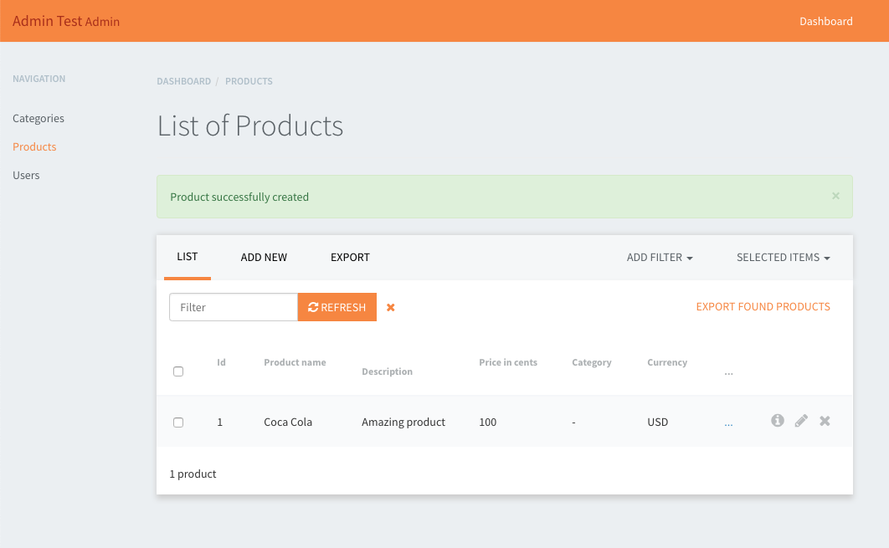

RailsAdminSoftwareBrothersTheme
===================================================

It is a clean theme which can be used with [Rails Admin](https://github.com/sferik/rails_admin).



Use a theme
---------------------------------------------------

In your Gemfile:

```
gem 'rails_admin_softwarebrothers_theme', :git => 'git@github.com:softwarebrothers/rails_admin_softwarebrothers_theme.git'
```

Inside config/application.rb, just after Bundler.require:

```
ENV['RAILS_ADMIN_THEME'] = 'softwarebrothers_theme'
```

## License

rails-admin-softwarebrothers-theme is Copyright © 2018 SoftwareBrothers.co. It is free software, and may be redistributed under the terms specified in the [LICENSE](LICENSE.md) file.

## About SoftwareBrothers.co


We are a software company who provides web and mobile development and UX/UI services, friendly team that helps clients from all over the world to transform their businesses and create astonishing products.

* We are available to [hire](https://softwarebrothers.co/contact).
* If you want to work for us - checkout the [career page](https://softwarebrothers.co/career).
